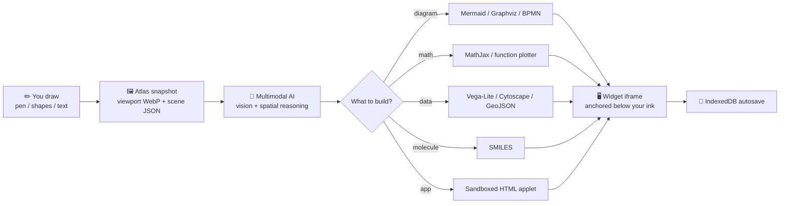

# Drawva 🎨⚡

A tile-based infinite whiteboard powered by a **multimodal AI perception agent** — draw anything, and the AI turns your sketches into diagrams, code, and math. Zero-cloud-database P2P sync via WebRTC.

---

## 🎬 Demo

<!-- TODO: add demo video -->

[]()

---

## 🧠 How It Works

You draw → Drawva sees → the AI reasons → it builds.



The whole thing runs on a stacked canvas engine — grid, tile cache, vector objects, and live interaction layers — rendered at 60fps, synced P2P with a 6-digit room code.

---

## 🚀 Setup

```bash
git clone https://github.com/taqui-786/drawva.git
cd drawva
pnpm install
pnpm dev
```

Open [http://localhost:3000](http://localhost:3000). Needs Node.js ≥ 18 and `pnpm@10.33.3`.

---

## 👤 About Me

Built by [Taqui Imam](https://taqui.in) — I like turning messy hand-drawn ideas into clean, working artifacts.

