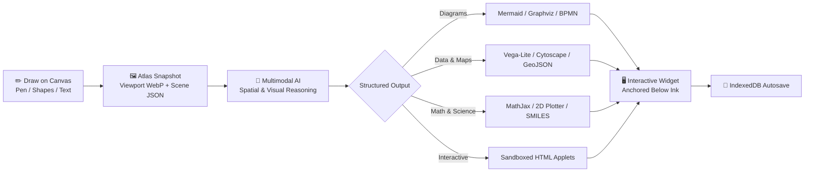

# Drawva 🎨⚡

A tile-based infinite whiteboard powered by a **multimodal AI perception agent** — draw anything, and AI turns your sketches into interactive diagrams, code, formulas, and data visualizations.

---

## 🧠 How It Works

You draw $\rightarrow$ Drawva captures $\rightarrow$ the AI reasons $\rightarrow$ it builds.



---

## ✨ Features

### 🖌️ Infinite Canvas & Drawing Tools
- **Stacked 60fps Canvas Engine**: Multi-layer rendering with infinite grid, 512px raster tile caching, vector objects, and real-time interaction previews.
- **Precision Drawing Tools**:
  - **Pen (`P`)** & **Highlighter (`Shift+H`)**: Smooth vector inking with customizable colors and stroke widths.
  - **Vector Shapes**: Rectangle (`R`), Ellipse (`O`), Arrow (`A`), and Line.
  - **Text Tool (`T`)**: Interactive inline text labels and notes.
  - **Stroke Eraser (`E`)**: Precision raycast stroke erasing.
  - **Selection & Marquee (`V`)**: Area drag selection, cluster lifting, moving, and deletion.
- **Smooth Navigation**: Pan with Hand tool (`H`) or middle-click, smooth trackpad pinch zoom & mouse wheel scaling ($0.03\times$ to $4.0\times$).

### 🤖 Multimodal AI Perception
- **Spatial Scene Understanding**: Combines viewport WebP snapshots with structured scene JSON to recognize handwriting, arrows, and layout context.
- **Context-Aware Placement**: Automatically generates widgets anchored directly below your latest drawings.
- **Custom OpenAI-Compatible Providers**: Connect any OpenAI-compatible endpoint (OpenRouter, Ollama, LM Studio, OpenAI, etc.).
- **Trigger Modes**: On-demand **Ask AI** or real-time **Auto AI** toggle.

> [!IMPORTANT]
> **AI Model Requirements:**
> - **Multimodal / Vision (Required)**: The selected model **must** accept both **image and text** inputs simultaneously (e.g., `gpt-4o`, `claude-3-5-sonnet`, `gemini-1.5-pro/flash`, `qwen2.5-vl`, `llama-3.2-vision`) to inspect your drawings and handwriting.
> - **Structured Output (Optional)**: If the model supports native structured JSON output / function calling, Drawva leverages it for highest schema precision; if not, Drawva automatically falls back to raw JSON parsing.

### 📊 7 Diagram Engines + Interactive Applets
Drawva turns sketches into interactive sandboxed iframe widgets with copyable source code, full-screen view, and draft confirmation:
- **Flowcharts & Sequences**: Mermaid.js diagrams (`mermaid`).
- **Dependency Networks**: Graphviz DOT graphs (`@viz-js/viz` WebAssembly).
- **Statistical Charts**: Vega-Lite data visualizations and bar charts.
- **Molecular Structures**: SMILES chemical compound 2D rendering (`openchemlib`).
- **Business Workflows**: BPMN XML process diagrams (`bpmn-viewer`).
- **Network Graphs**: Interactive Cytoscape graph visualizations.
- **Geographic Maps**: GeoJSON maps powered by Leaflet.
- **LaTeX Math Formulas**: MathJax SVG typesetting.
- **2D Function Plotter**: Safe math expression graphing.
- **Live HTML Applets**: Fully functional sandboxed HTML/CSS/JS mini-apps.

### 💾 Persistence & Export
- **Local Autosave**: Seamless client-side persistence using IndexedDB (`drawva-canvas-db`).
- **Export & Import**: Export high-resolution PNG snapshots, save canvas state to JSON, or load previous project files.

---

## 🚀 Getting Started

### Prerequisites
- Node.js $\ge 18$
- `pnpm` (version `10.33.3` recommended)
- An OpenAI-compatible API key & model supporting **both image and text inputs** (vision-capable)

### Installation

```bash
# Clone the repository
git clone https://github.com/taqui-786/drawva.git
cd drawva

# Install dependencies
pnpm install

# Start development server
pnpm dev
```

Open [http://localhost:3000](http://localhost:3000) in your browser. Configure your AI model provider in **Settings** (top right) to start generating.

---

## 👤 Author

Built with ❤️ by **[Taqui Imam](https://taqui.in)**
